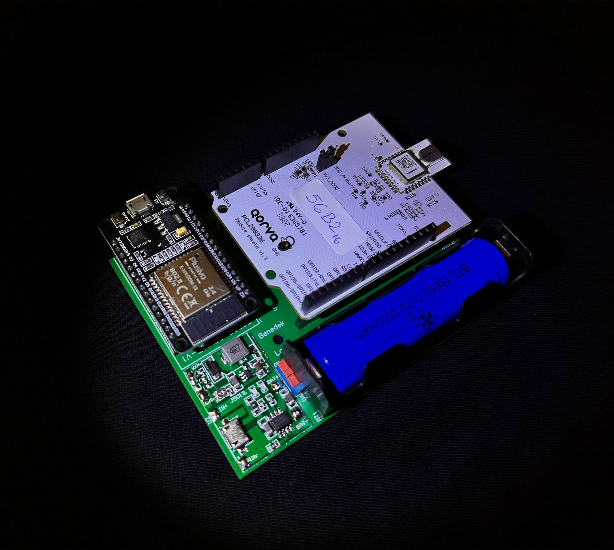
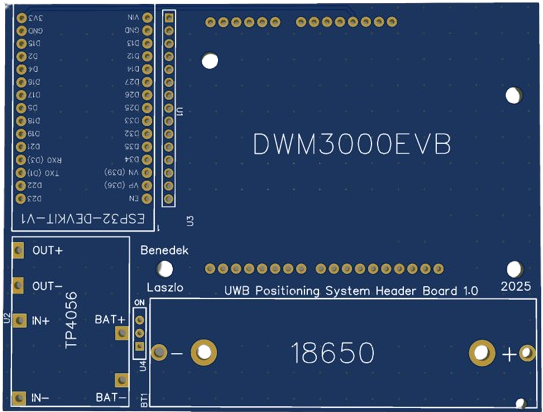
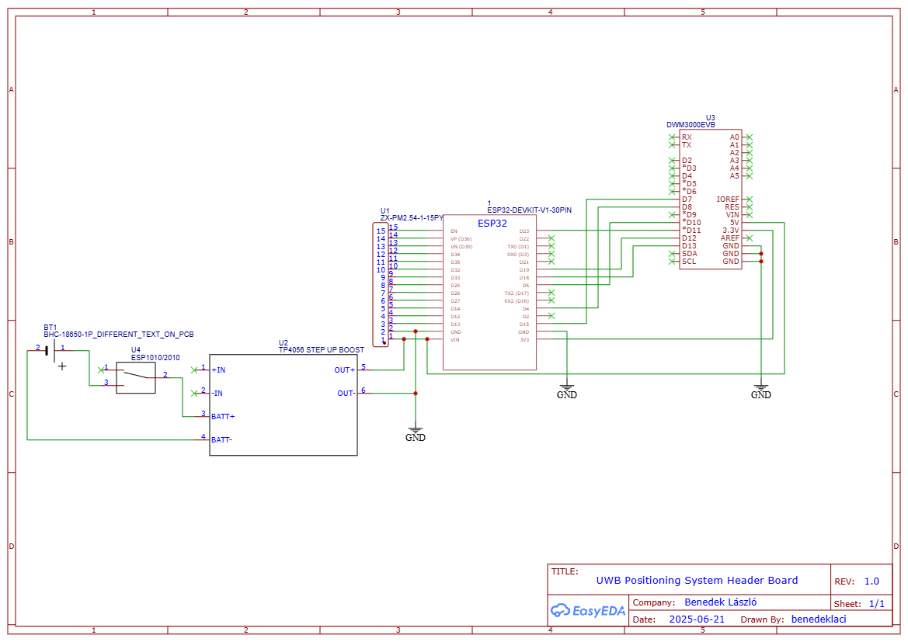

# Modular UWB Anchor Design

> **Note**
> The EasyEDA design is available at: https://oshwlab.com/benedeklaci/uwb-positioning-system-header.

The anchor nodes utilize a custom, modular hardware architecture designed for autonomous operation and easy maintenance. Central to the design is an ESP32 microcontroller interfacing with a Qorvo DWM3000EVB shield.

Power is managed by a TP4056 module coupled with a standard 18650 Li-ion battery, allowing for completely wireless deployment. The custom PCB features female headers that enable the development boards to be plugged in directly, ensuring mechanical stability without permanent soldering.

## Assembled board

## PCB 2D View

## PCB Top View

## PCB Bottom View

## Schematic

